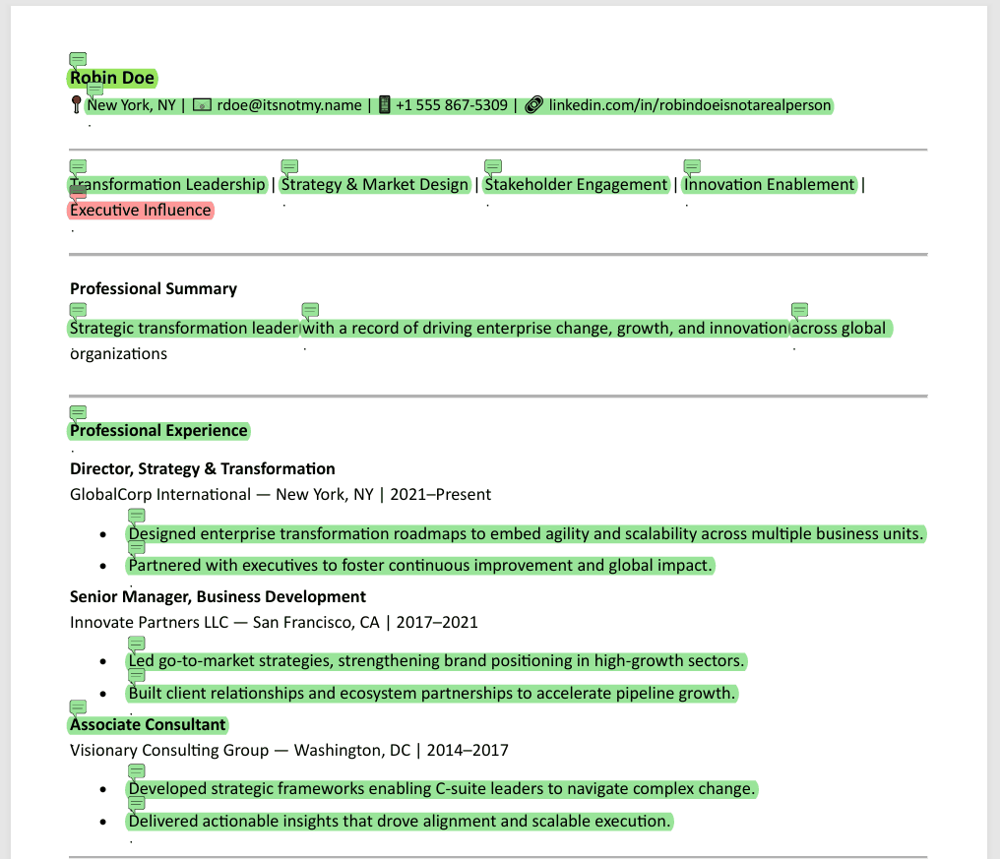
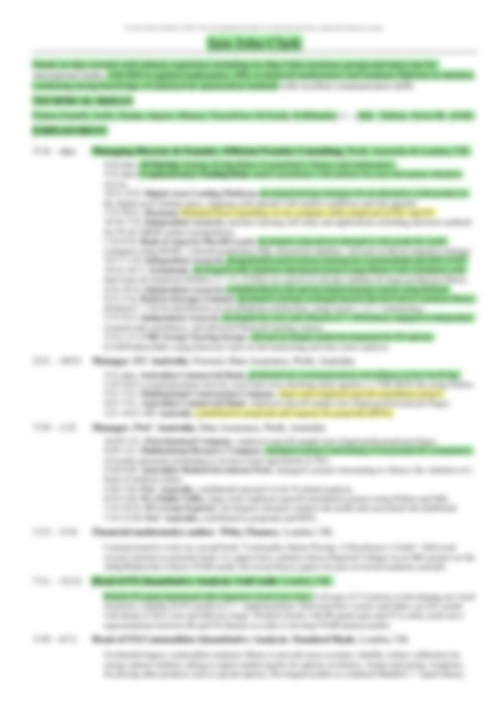
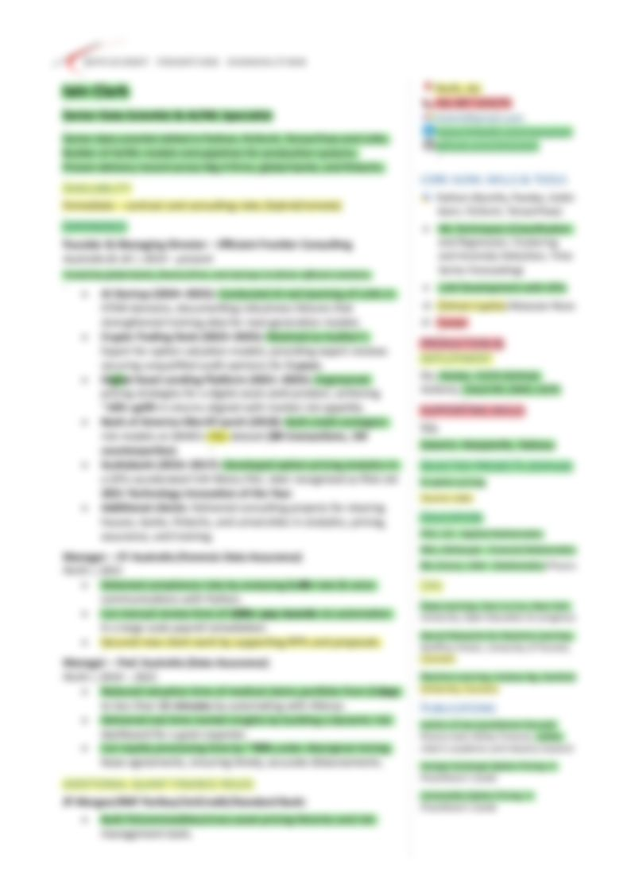

# resume-radar


[](https://www.linkedin.com/in/iainjclark/)

Independently developed proof-of-concept → AI that reviews & decorates your CV.

Built from scratch in a weekend, accelerated with ChatGPT and GitHub Copilot.
- LLM-authored hover tips  
- Traffic-light comments highlight the document's strengths & weaknesses  
- PDF in → PDF out → shake it all about 

## 🎥 Demo  

This is Robin's CV. Watch how LLM-generated, data-driven insights emerge dynamically.

<p align="center">
  
</p>

<p align="center">
  
</p>


👉 Want to see the insights?  
[Download a sample interactive annotated CV (PDF)](assets/CV_RobinDoe_reviewed.pdf) 

## 📝 Case Study

Ran this on my *own* CV — it flagged some areas to improve, and some that it still wants me to improve!  

<p align="center">
  
  
</p>

Potential clients and recruiters: feel free to ask to see the before/after copy. Delighted to share!  
*(Always looking to take on great new clients.)*

## 🧩 Design Philosophy

resume-radar takes a **three-pass review approach**, inspired by how a human would read a CV:

1. **Global pass** → read the entire CV for overall impression, with a summary of strengths and weaknesses.  
2. **Sectional pass** → review each section (e.g. Experience, Education, Skills) in context.  
3. **Line-by-line pass** → detailed critique of individual lines/chunks, with context from earlier passes.  

This layered method ensures that the increasingly granular feedback (step 2, then step 3) isn’t just making a superficial review of the  text with little appreciation of its context — it’s informed by the broader narrative of the CV, and this is _by design_.

Code elements for these 3 steps: **global_llm_reflection.py** | **sectional_llm_critique.py** | **granular_llm_critique.py**

## 🧩 Prompt Engineering

resume-radar relies on carefully structured LLM prompts, all in [`llm_prompts.py`](llm_prompts.py), a precis of which can be shown here:

- **Global pass** 🌍 
  ```txt
  You are a professional CV reviewer. Read the CV in full and provide a JSON object with these fields...
  ```

- **Section level pass** 🌍 
  ```txt
  You are a CV reviewer. Rate this section of a CV out of 20....
  ```

- **Granular pass** 🌍 
  ```txt
  You are a CV reviewer. Analyze the following CV element in detail. For each key sentence or phrase, provide: ...
  ```


## 📄 PDF Extraction

By default, **resume-radar** uses [PyMuPDF (`fitz`)](https://pymupdf.readthedocs.io/) for PDF text extraction, which usually produces cleaner results than [PyPDF2](https://pypi.org/project/pypdf2/).  

You can switch methods in `main.py`:  
```python
sample_text = extract_text_from_pdf(pdf_path, method="pypdf2")   # fallback
sample_text = extract_text_from_pdf(pdf_path, method="pymupdf")  # default
```

## Development Setup

1. Clone and navigate to the repo
   ```bash
   git clone https://github.com/iainjclark/resume-radar.git
   cd resume-radar
   ```

2. Install dependencies:
   ```bash
   pip install -r requirements.txt
   ```

3. Create a .env file in the root dir with your API Key 🔑 
   ```env
   OPENAI_API_KEY=sk-your-real-key
   ```
> This project uses the [OpenAI Python client](https://github.com/openai/openai-python) and will need you to provide your OpenAI key -- see .env.example for guidance. For security, the API key is stored in a local `.env` file that is **never** committed to git.
> Need help? Follow [OpenAI’s guide to creating an API key](https://platform.openai.com/docs/quickstart/step-2-set-up-your-api-key).

4. Run the app:
   ```bash
   python main.py inputs/CV_RobinDoe.pdf
   python main.py inputs/CV_RobinDoe.pdf -o outputs/RobinDoe_re-reviewed.pdf
   ```

## 🚀 Future Work / Roadmap

resume-radar started as a rapid proof-of-concept, but there are plenty of ways it could grow:
- **.docx support** → extend beyond PDFs to handle Microsoft Word resumes. This will be trickier because .docx parsing and re-injecting of annotations is a bit of a nightmare (PDFs were bad enough!)
- **Recruiter vs hiring manager mode change 🔍** → modify the LLM prompt to adopt a different 'lens' for the review (easy)
- **Abstractify the LLM backend** → support LLMs other than ChatGPT (OpenAI).
- **Dashboard / UI** → simple visual interface for uploading and annotating resumes - drag & drop, ideally.  
- **Live demo** → Streamlit? HF Space? Idea being that anyone could try this out without cloning the repo.
- **Heatmap** → add a color scale from bright red → orange → yellow → neutral → light green → bright green.  
  Originally planned but pressed for time; relatively straightforward to implement. Details details.

## AI Disclosure Notes  

This project was accelerated with the support of AI coding tools (GitHub Copilot and ChatGPT).  
The architecture, design philosophy, and final validation were directed by me and I claim ownership of those elements.

## 🤝 Connect 
  
<a href="https://www.linkedin.com/in/iainjclark/" target="_blank">
  
</a>
<a href="https://www.linkedin.com/in/iainjclark/">www.linkedin.com/in/iainjclark</a>

